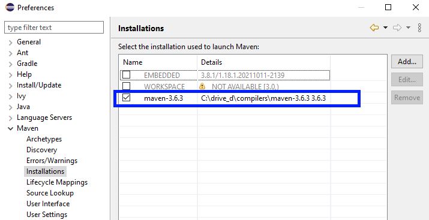
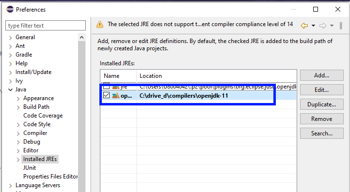
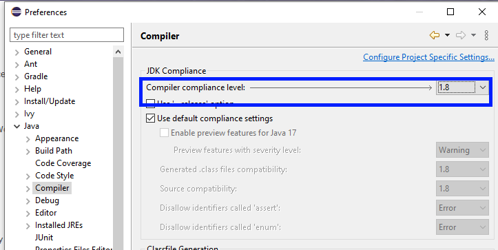

# How to Set Up Real-Time SDK Java Application with Maven on the Eclipse IDE

- version: 1.0.0
- Last update: January 20222
- Environment: Windows, Linux
- Compiler: Java
- Prerequisite: [Eclipse Maven prerequisite](#prerequisite)

## <a id="Introduction"></a>Introduction


[Refinitiv Real-Time SDK (Java Edition)](https://developers.refinitiv.com/en/api-catalog/refinitiv-real-time-opnsrc/rt-sdk-java) (RTSDK, formerly known as Elektron SDK) is a suite of modern and open source APIs that aim to simplify development through a strong focus on ease of use and standardized access to a broad set of Refinitiv proprietary content and services via the proprietary TCP connection named RSSL and proprietary binary message encoding format named OMM Message. The capabilities range from low latency/high-performance APIs right through to simple streaming Web APIs. 

The SDK has been mavenized to support [Apache Maven](https://maven.apache.org/) and [Gradle](https://gradle.org/) build automation tools since version 1.2. This supports helps Java developers to build the RTSDK Java application, manage its dependencies (Java Developers do not need to manually manage different versions of jar files anymore), and better collaboration in the team.

The [previous article](https://developers.refinitiv.com/en/article-catalog/article/how-to-set-up-refinitiv-real-time-sdk-java-application-with-mave) ([Medium](https://wasin-waeosri.medium.com/how-to-deploy-and-run-real-time-java-application-with-maven-in-docker-58e66dd1e247)) shows how to set up the EMA Java project with Maven via a command line. However, many developers are using the [Eclipse IDE](https://www.eclipse.org/) for Java application development. This example project shows how to create the RTSDK - Java's Maven project with Eclipse to get the library dynamically and run the EMA Java examples.  

Disclaimer: I am using the [IntelliJ IDEA](https://www.jetbrains.com/idea/) and [Visual Studio Code](https://code.visualstudio.com/) as my main IDE/editor.

## <a id="prerequisite"></a>Eclipse Maven Prerequisite

To use the Eclipse IDE with Maven, you need the following software.

### Eclipse IDE

This example project is based on the Eclipse IDE for Java Developers version 2012-12 (4.22.0). You can download the installation package from [the Eclipse Foundation](https://www.eclipse.org/) website.

If you are using a different version of Eclipse, some steps may be different, but the concept is still the same.

### Java SDK and Maven 

You need the [Oracle Java Development Kit](https://jdk.java.net/) or [Open JDK](https://openjdk.java.net/), and [Apache Maven](https://maven.apache.org/) in your machine. Please check the RTSDK - Java README file or [API Compatibility Matrix file](https://developers.refinitiv.com/en/api-catalog/refinitiv-real-time-opnsrc/rt-sdk-java/documentation) for more detail regarding the supported JDK versions.

This project is based on the Open JDK version "11" (2018-09-25) and Maven version 3.6.3.

### M2Eclipse

The [M2Eclipse](https://www.eclipse.org/m2e/) plugin provides integration for Apache Maven into the Eclipse IDE. Please check the [Installation section](https://github.com/eclipse-m2e/m2e-core/blob/master/README.md#-installation) on the project GitHub page about how to install the plugin. 

### Internet Access to Maven Central Repository

The Refinitiv Real-Time SDK Java is now available in [Maven Central Repository](https://search.maven.org/). You can define the following dependency in Maven's pom.xml file to let Maven automatically download the [EMA Java library](https://search.maven.org/artifact/com.refinitiv.ema/ema/) and [ETA Java library](https://search.maven.org/artifact/com.refinitiv.eta/eta) for the application.


Note: 
- This article is based on EMA Java version 3.6.4 L1 (RTSDK Java Edition 2.0.4 L1). 

## <a id="rtsdk_maven_basic"></a>The Basic of RTSDK Java with Maven

This example project is focusing on setting the Eclipse IDE for the RTSDK Java project with Maven only. You can find the basic knowledge of how to use the RTSDK Java with Maven, Maven pom.xml setting for EMA Java, Standard Directory Layout, etc. from the [How to Set Up Refinitiv Real-Time SDK Java Application with Maven](https://developers.refinitiv.com/en/article-catalog/article/how-to-set-up-refinitiv-real-time-sdk-java-application-with-mave) article ([Medium](https://wasin-waeosri.medium.com/how-to-deploy-and-run-real-time-java-application-with-maven-in-docker-58e66dd1e247)).

## <a id="ide_setup"></a>IDE Set Up

### Step 1: Creating a new workspace

Firstly, create a new workspace. I pick *C:\rtsdk_maven_eclipse* folder as my workspace location. The location and file name are based on your machine preference.

You can create a new workspace by setting the *C:\rtsdk_maven_eclipse* location in the Eclipse IDE launcher. 


Then, a new workspace is created.


### Step 2: Set Up Default Maven and JDK

The next step is setting up the default Maven and JDK runtime path in Eclipse. 

Let's open the IDE toolbar **Window -> Preferences** menu and choose **Maven --> Installation** option. Then add your local Maven installation path and tick the checkbox in front of it.



Note: You need to install the [M2E plugin](https://github.com/eclipse-m2e/m2e-core/blob/master/README.md#-installation) before this step.

Moving on to the JDK setting. In the **Window -> Preferences** menu, choose **Java --> Installed JREs** option. Add your local JDK 11 installation path and tick the checkbox in front of it.



Stay in the  Java setting, choose the **Compiler** option and set the **Compiler compliance level:** to **1.8**.



### Step 3: Create a new Maven Project

That brings us to the Maven Project creation with Eclipse. You can create a new Maven project with the **File --> New --> Other..." menu option


Then select the **Maven Project** option and click Next.


Choose the **Create a simple project (skip archetype selection)** option, and then click the next button.


Now it is time to set the basic Maven pom.xml properties. I set this example project with the following properties:
- Group Id: ```com.refinitiv.ema```
- Artifact Id: ```EMA_Java_204L1_Maven```
- Version: ```1.0.0-SNAPSHOT```
- Name: ```EMA_Java_204L1_Maven```


Then click the Finish button, a new Maven project is newly created. 


### Step 4: Set up the Project setting for RTSDK

Before we add the EMA Java code and configurations, there are some project-specific settings that we need to set them first.

Right-click on the project in the Package Explorer panel, and choose the **Properties** option.


**Uncheck** the **Enable project specific settings** option.


### Step 5: Set up Maven Pom.xml file

Open the Project's *pom.xml* file in the Eclipse IDE, then set the following EMA Java application dependencies in the Maven pom.xml file. The EMA Java is the message-level API built on top of the ETA Java (Transport API), the Maven can automatically pull all dependency artifacts within Maven central for the application.

```
<project xmlns="http://maven.apache.org/POM/4.0.0" xmlns:xsi="http://www.w3.org/2001/XMLSchema-instance" xsi:schemaLocation="http://maven.apache.org/POM/4.0.0 https://maven.apache.org/xsd/maven-4.0.0.xsd">
  <modelVersion>4.0.0</modelVersion>
  <groupId>com.refinitiv.ema</groupId>
  <artifactId>EMA_Java_204L1_Maven</artifactId>
  <version>1.0.0-SNAPSHOT</version>
  <name>EMA_Java_204L1_Maven</name>

   <properties>
        <project.build.sourceEncoding>UTF-8</project.build.sourceEncoding>
        <maven.compiler.source>11</maven.compiler.source>
        <maven.compiler.target>11</maven.compiler.target>
        <rtsdk.version>3.6.4.0</rtsdk.version>
        <javafx.version>15.0.1</javafx.version>
    </properties>

     <dependencies>

        <dependency>
            <groupId>junit</groupId>
            <artifactId>junit</artifactId>
            <version>4.11</version>
            <scope>test</scope>
        </dependency>

        <dependency>
            <groupId>com.refinitiv.ema</groupId>
            <artifactId>ema</artifactId>
            <version>${rtsdk.version}</version>
        </dependency>
        
        <dependency>
            <groupId>org.openjfx</groupId>
            <artifactId>javafx-fxml</artifactId>
            <version>${javafx.version}</version>
        </dependency>
        
    </dependencies>
</project>
```

You may be noticed that I have added the [JavaFX](https://openjfx.io/) dependencies to the Maven pom.xml file as well. This dependency is for the EMA GUI example.

### Step 6: Add EMA Java Example Source Code to the Project

The EMA Java example source code is available at the **RTSDK Java package/Java/Ema/Example/src/main** folder. 


You can copy an entire **main** folder to replace the **Workspace/EMA_Java_204L1_Maven/src/main** folder.


Next, copy the EMA Configuration **EmaConfig.xml** file from the **RTSDK Java package/Java/Ema/** folder to the root folder of the EMA_Java_204L1_Maven project.


Additionally, you may copy the local dictionary files folder (**RTSDK Java package/Java/etc/**) to the root folder of the EMA_Java_204L1_Maven project if you want to use local dictionary files.  


You can find more detail about the EmaConfig.xml and local dictionary configurations on the [Enterprise Message API (EMA) - Configuration Overview](https://developers.refinitiv.com/en/article-catalog/article/elektron-message-api-ema-configuration-overview) article.

Finally, right-click on the project and choose the **Refresh** option to make the newly added codes to the project. 


Now the *EMA_Java_204L1_Maven* project and Eclipse IDE are ready to run the RTSDK Java.

## <a id="rto_console"></a> Running the RTO Console Example.

Let's start by running the Refinitiv Real-Time -- Optimized (RTO) example ex450_MP_QueryServiceDiscovery. Firstly, create a Run Configuration for the ex450_MP_QueryServiceDiscovery example application. 


I set a configuration name as *Consumer -example 450*. Please do not forget to set the Main class to *ex450_MP_QueryServiceDiscovery's Consumer class*.


Next, click the Arguments tab, and input the RTO credentials as command-line arguments. You can check the list of supported parameters from the example readme and source code files.


Finally, click the Apply and Run buttons to start the RTO example.


You can find more detail about the Eclipse IDE Run and Run Configuration from the [TutorialsPoint](https://www.tutorialspoint.com/eclipse/eclipse_run_configuration.htm) page.

## <a id="rto_GUI"></a> Running the GUI Example.

The EMA Java GUI example is the Refinitiv Real-Time Market Data Viewer (RRTViewer). The RRTViewer supports the RSSL and WebSocket connections for both local RTDS and RTO deployment scenarios. This session covers the RTO with the Service Discovery scenario only, but the GUI interface and flow of the RTDS scenario are not that different. 

Firstly, create a Run Configuration for the RRTViewer example application. Please do not forget to set the Main class to *com.refinitiv.ema.examples.rrtmdviewer.desktop.RRTMDViewerDesktopMain class*.


Then, click run to start the example application. The first screen lets you choose between the following options:
- Discovery Endpoint: Connect to RTO with the Service Discovery
- Specify Endpoint: Connect to your local RTDS server

Let's choose the *Discover Endpoint* options and then click the next button.


Next, input your RTO credentials and click the Retrieve Service Endpoints button. Please note that you can choose whether you want to connect with the RSSL or WebSocket connection too.


Then, the example application authenticates with the RDP Auth Service and gets the list of endpoints from the RDP Service Discovery. You can select the endpoint that you want to connect to and then click the connect button.


Once the connection is succeeded, you can select the Real-Time service name, data domain, input RICs name, set the subscription properties, and then click the submit button. The real-time data is shown on the right panel.


That's all for the Real-Time Market Data Viewer example. 

## <a id="files_list"></a>Application Files
This example project contains the following files and folders
1. pom.xml: Example pom.xml file.
2. LICENSE.md: Project's license file.
3. README.md: Project's README file.

## <a id="conclusion"></a>Conclusion

Eclipse is one of the most popular IDEs for Java development. With the Maven integration (via the M2Eclipse plugin), developers can create and manage the development project faster than the old manual way. Developers do not need to manually maintain jars file dependencies anymore. This helps when updating the library versions, sharing the project among peers, and supports various build processes that match developers' workflow.   

The RTSDK Java is now available in [Maven central repository](https://search.maven.org/) which makes Java developers can implement the Real-Time application with the build automation tools such as [Apache Maven](https://maven.apache.org/), [Gradle](https://gradle.org/). Java developers who are using the Eclipse IDE to set up the development project with the RTSDK Java by just adding the EMA or ETA API dependencies to the pom.xml file.

Note: The IntelliJ IDEA already has built-in Maven (and Gradle) support. 

## <a id="ref"></a>References

For further details, please check out the following resources:
* [Refinitiv Real-Time SDK Java page](https://developers.refinitiv.com/en/api-catalog/refinitiv-real-time-opnsrc/rt-sdk-java) on the [Refinitiv Developer Community](https://developers.refinitiv.com/) web site.
* [Refinitiv Real-Time SDK Family](https://developers.refinitiv.com/en/use-cases-catalog/refinitiv-real-time) page.
* [Enterprise Message API Java Quick Start](https://developers.refinitiv.com/en/api-catalog/refinitiv-real-time-opnsrc/rt-sdk-java/quick-start)
* [Developer Webinar: Introduction to Enterprise App Creation With Open-Source Enterprise Message API](https://www.youtube.com/watch?v=2pyhYmgHxlU)
* [Developer Article: 10 important things you need to know before you write an Enterprise Real Time application](https://developers.refinitiv.com/article/10-important-things-you-need-know-you-write-elektron-real-time-application)
* [Developer Article: How to Set Up Refinitiv Real-Time SDK Java Application with Maven](https://developers.refinitiv.com/en/article-catalog/article/how-to-set-up-refinitiv-real-time-sdk-java-application-with-mave).
* [Developer Article: How to deploy and run Real-Time Java Application with Maven in Docker](https://developers.refinitiv.com/en/article-catalog/article/how-to-deploy-and-run-real-time-java-application-with-maven-in-d).
* [Developer Article: Testing Real-time Streaming applications with Docker & Refinitiv Real-Time Connector (part 1)](https://developers.refinitiv.com/en/article-catalog/article/testing-real-time-apps-with-docker-and-real-time-connector).
* [Developer Article: Testing Real-time Streaming applications with Docker & Refinitiv Real-Time Connector (part 2)](https://developers.refinitiv.com/en/article-catalog/article/testing-real-time-apps-with-docker-and-real-time-connector-2).
* [Developer Article: How to use the Refinitiv Real-Time SDK Docker Images on the Visual Studio Code with the Remote - Containers extension](https://developers.refinitiv.com/en/article-catalog/article/how-to-use-the-refinitiv-real-time-sdk-docker-images-on-the-visu).
* [Apache Maven Project page](https://www.apache.org/)
* [Maven Getting Started Guide](https://maven.apache.org/guides/getting-started/)
* [Maven in 5 Minutes](https://maven.apache.org/guides/getting-started/maven-in-five-minutes.html)
* [Maven Central Repository Search](https://search.maven.org/)
* [Maven - Eclipse IDE tutorial](https://www.tutorialspoint.com/maven/maven_eclispe_ide.htm).

For any questions related to this article or the RTSDK page, please use the Developer Community [Q&A Forum](https://community.developers.refinitiv.com/).