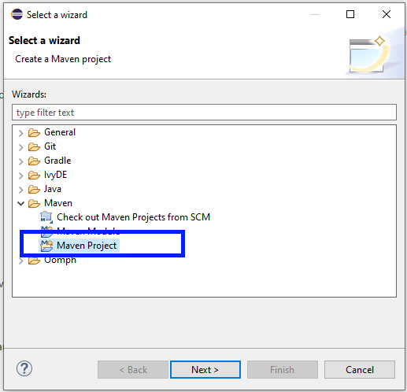
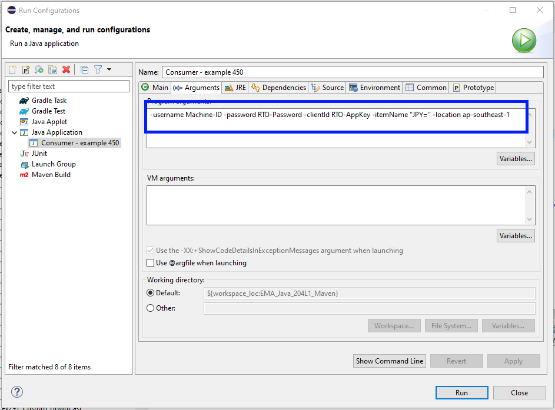

# How to Set Up Real-Time SDK Java Application with Maven on the Eclipse IDE

- version: 1.0.0
- Last update: January 20222
- Environment: Windows, Linux
- Compiler: Java
- Prerequisite: [Demo prerequisite](#prerequisite)

## <a id="Introduction"></a>Introduction


[Refinitiv Real-Time SDK (Java Edition)](https://developers.refinitiv.com/en/api-catalog/refinitiv-real-time-opnsrc/rt-sdk-java) (RTSDK, formerly known as Elektron SDK) is a suite of modern and open source APIs that aim to simplify development through a strong focus on ease of use and standardized access to a broad set of Refinitiv proprietary content and services via the proprietary TCP connection named RSSL and proprietary binary message encoding format named OMM Message. The capabilities range from low latency/high-performance APIs right through to simple streaming Web APIs. 

The SDK has been mavenized to support [Apache Maven](https://maven.apache.org/) and [Gradle](https://gradle.org/) build automation tools since version 1.2. This supports helps Java developers to build the RTSDK Java application, manage its dependencies (Java Developers do not need to manually manage different versions of jar files anymore), and better collaboration in the team.

The [previous article](https://developers.refinitiv.com/en/article-catalog/article/how-to-set-up-refinitiv-real-time-sdk-java-application-with-mave) ([Medium](https://wasin-waeosri.medium.com/how-to-deploy-and-run-real-time-java-application-with-maven-in-docker-58e66dd1e247)) shows how to set up the EMA Java project with Maven via a command line. However, many Java developers are still using the [Eclipse IDE](https://www.eclipse.org/), which is the classic, multi-features, and tons of plugins.  This example project shows how to create the RTSDK - Java's Maven project with Eclipse. Developers do not need to run any commands manually via the command line. 

Disclaimer: I am using the [IntelliJ IDEA](https://www.jetbrains.com/idea/) and [Visual Studio Code](https://code.visualstudio.com/) as my main IDE/editor.

## <a id="prerequisite"></a>Prerequisite

To use the Eclipse IDE with Maven, you need the following software.

### Eclipse IDE

This example project is based on the Eclipse IDE for Java Developers version 2012-12 (4.22.0). You can download the installation package from [the Eclipse Foundation](https://www.eclipse.org/) website.

### Java SDK and Maven 

You need the [Oracle Java Development Kit](https://jdk.java.net/) or [Open JDK](https://openjdk.java.net/), and [Apache Maven](https://maven.apache.org/) in your machine. Please check the RTSDK - Java README file or [API Compatibility Matrix file](https://developers.refinitiv.com/en/api-catalog/refinitiv-real-time-opnsrc/rt-sdk-java/documentation) for more detail regarding the supported JDK versions.

This project is based on the Open JDK version "11" (2018-09-25) and Maven 3.6.3

### M2Eclipse

The [M2Eclipse](https://www.eclipse.org/m2e/) plugin provides integration for Apache Maven into the Eclipse IDE. Please check the [Installation section](https://github.com/eclipse-m2e/m2e-core/blob/master/README.md#-installation) on the project GitHub page regarding how to install the plugin. 

### Internet Access to Maven Central Repository

The Refinitiv Real-Time SDK Java is now available in [Maven Central Repository](https://search.maven.org/). You can define the following dependency in Maven's pom.xml file to let Maven automatically download the [EMA Java library](https://search.maven.org/artifact/com.refinitiv.ema/ema/) and [ETA Java library](https://search.maven.org/artifact/com.refinitiv.eta/eta) for the application.


Note: 
- This article is based on EMA Java version 3.6.4 L1 (RTSDK Java Edition 2.0.4 L1). 

## <a id="rtsdk_maven_basic"></a>The Basic of RTSDK Java with Maven

This example project is focusing on setting the Eclipse IDE for the RTSDK Java project with Maven only. You can find the basic knowledge of how to use the RTSDK Java with Maven, Maven pom.xml setting for EMA Java, Standard Directory Layout, etc. from the [How to Set Up Refinitiv Real-Time SDK Java Application with Maven](https://developers.refinitiv.com/en/article-catalog/article/how-to-set-up-refinitiv-real-time-sdk-java-application-with-mave) article ([Medium](https://wasin-waeosri.medium.com/how-to-deploy-and-run-real-time-java-application-with-maven-in-docker-58e66dd1e247)).

## <a id="ide_setup"></a>IDE Set Up

### Step 1: Creating a new workspace

Firstly, create a new workspace. I pick *C:\rtsdk_maven_eclipse* folder as my workspace location. The location and file name are based on your machine preference.

You can create a new workspace by setting the *C:\rtsdk_maven_eclipse* location in the Eclipse IDE launcher. 


Then, a new workspace is created.


### Step 2: Set Up Default Maven and JDK

The next step is setting up the default Maven and JDK runtime path in Eclipse. 

Let's open the IDE toolbar **Window -> Preferences** menu and choose **Maven --> Installation** option. Then add your local Maven installation path and tick the checkbox in front of it.


Note: You need to install the [M2E plugin](https://github.com/eclipse-m2e/m2e-core/blob/master/README.md#-installation) before this step.

Moving on to the JDK setting. In the **Window -> Preferences** menu, choose **Java --> Installed JREs** option. Add your local JDK 11 installation path and tick the checkbox in front of it.


Stay in the  Java setting, choose the **Compiler** option and set the **Compiler compliance level:** to **1.8**.


### Step 3: Create a new Maven Project

That brings us to the Maven Project creation with Eclipse. You can create a new Maven project with the **File --> New --> Other..." menu option


Then select the **Maven Project** option and click Next.



Choose the **Create a simple project (skip archetype selection)** option, and then click the next button.


Now it is time to set the basic Maven pom.xml properties. I set this example project with the following properties:
- Group Id: ```com.refinitiv.ema```
- Artifact Id: ```EMA_Java_204L1_Maven```
- Version: ```1.0.0-SNAPSHOT```
- Name: ```EMA_Java_204L1_Maven```


Then click the Finish button, a new Maven project is newly created. 


### Step 4: Set up the Project setting for RTSDK

Before we add the EMA Java code and configurations, there are some project-specific settings that we need to set them first.

Right-click on the project in the Package Explorer panel, and choose the **Properties** option.


**Uncheck** the **Enable project specific settings** option.


### Step 5: Set up Maven Pom.xml file

Open the Project's *pom.xml* file in the Eclipse IDE, then set the following EMA Java application dependencies in the Maven pom.xml file. The EMA Java is the message-level API built on top of the ETA Java (Transport API), the Maven can automatically pull all dependency artifacts within Maven central for the application.

```
<project xmlns="http://maven.apache.org/POM/4.0.0" xmlns:xsi="http://www.w3.org/2001/XMLSchema-instance" xsi:schemaLocation="http://maven.apache.org/POM/4.0.0 https://maven.apache.org/xsd/maven-4.0.0.xsd">
  <modelVersion>4.0.0</modelVersion>
  <groupId>com.refinitiv.ema</groupId>
  <artifactId>EMA_Java_204L1_Maven</artifactId>
  <version>1.0.0-SNAPSHOT</version>
  <name>EMA_Java_204L1_Maven</name>

   <properties>
        <project.build.sourceEncoding>UTF-8</project.build.sourceEncoding>
        <maven.compiler.source>11</maven.compiler.source>
        <maven.compiler.target>11</maven.compiler.target>
        <rtsdk.version>3.6.4.0</rtsdk.version>
        <javafx.version>11</javafx.version>
    </properties>

	 <dependencies>

        <dependency>
            <groupId>junit</groupId>
            <artifactId>junit</artifactId>
            <version>4.11</version>
            <scope>test</scope>
        </dependency>

        <dependency>
            <groupId>com.refinitiv.ema</groupId>
            <artifactId>ema</artifactId>
            <version>${rtsdk.version}</version>
        </dependency>
		
        <dependency>
            <groupId>org.openjfx</groupId>
            <artifactId>javafx-fxml</artifactId>
            <version>${javafx.version}</version>
        </dependency>
		
    </dependencies>
</project>
```

You may be noticed that I have added the [JavaFX](https://openjfx.io/) dependency to the Maven pom.xml file as well. This dependency is for the EMA GUI example.

### Step 6: Add EMA Java Example Source Code to the Project

The EMA Java example source code is available at the **RTSDK Java package/Java/Ema/Example/src/main** folder. 


You can copy an entire **main** folder to replace the **Workspace/EMA_Java_204L1_Maven/src/main** folder.


Next, copy the EMA Configuration **EmaConfig.xml** file from the **RTSDK Java package/Java/Ema/** folder to the root folder of the EMA_Java_204L1_Maven project.


Additionally, you may copy the local dictionary files folder (**RTSDK Java package/Java/etc/**) to the root folder of the EMA_Java_204L1_Maven project if you want to use local dictionary files.  


You can find more detail about the EmaConfig.xml and local dictionary configurations on the [Enterprise Message API (EMA) - Configuration Overview](https://developers.refinitiv.com/en/article-catalog/article/elektron-message-api-ema-configuration-overview) article.

Finally, right-click on the project and choose the **Refresh** option to make the newly added codes to the project. 


Now the *EMA_Java_204L1_Maven* project and Eclipse IDE are ready to run the RTSDK Java.

## <a id="rto_console"></a> Running the RTO Console Example.

Let's start by running the Refinitiv Real-Time -- Optimized (RTO) example ex450_MP_QueryServiceDiscovery. Firstly, create a Run Configuration for the ex450_MP_QueryServiceDiscovery example application. 


I set a configuration name as *Consumer -example 450*. Please do not forget to set the Main class to *ex450_MP_QueryServiceDiscovery's Consumer


Next, click the Arguments tab, and input the RTO credentials as command-line arguments. You can check the list of supported parameters from the example readme and source code files.



Finally, click the Apply and Run buttons to start the RTO example.


You can find more detail about the Eclipse IDE Run and Run Configuration from the [TutorialsPoint](https://www.tutorialspoint.com/eclipse/eclipse_run_configuration.htm) page.

## <a id="rto_GUI"></a> Running the GUI Example.


